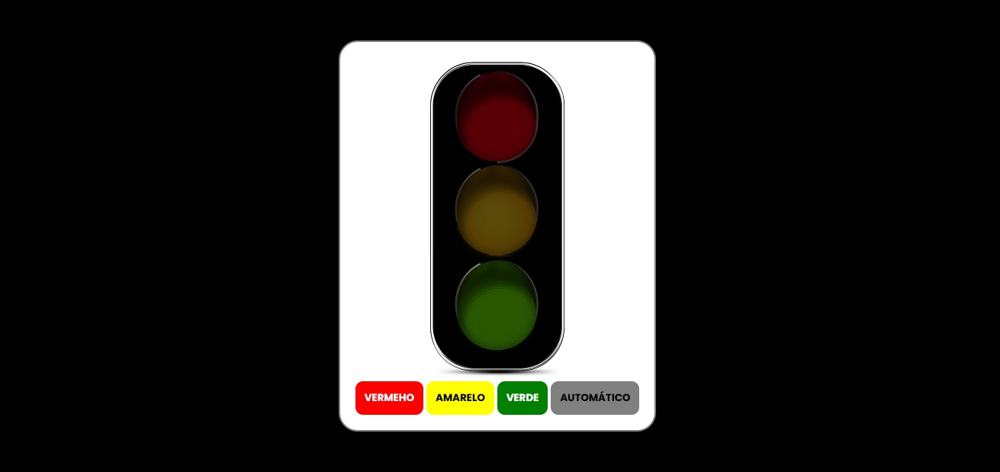

# 📌 Semaforo

Semáforo utilizando somente HTML/CSS/JavaScript

---

## 🔗 Acesso ao projeto

[🔗 Clique aqui para acessar](https://luis-hans.github.io/Semaforo/)

---

## 🎯 Funcionalidades

- [x] Trocar as cores do semáforo.
- [x] Ativar o modo automático.

---

## 🖼️ Preview



---

## 🚀 Tecnologias utilizadas

- HTML.
- CSS.
- JAVASCRIPT.

---

## ⚙️ Como usar

```bash
# Clone o repositório
git clone https://github.com/Luis-hans/semaforo

# Acesse a pasta do projeto
cd semaforo

# Abra o arquivo index.html no navegador
```

---

## 📚 Aprendizados

Utilizar mais as arrow functions e os objetos dentro delas.

---

## 🧾 Licença

Este projeto está sob a licença MIT. Sinta-se à vontade para usar, modificar e compartilhar!

---

## 🤝 Contato

Feito por Luís Henrique  
📬 luishenrique.lhans@gmail.com  
🐙 https://github.com/Luis-hans
